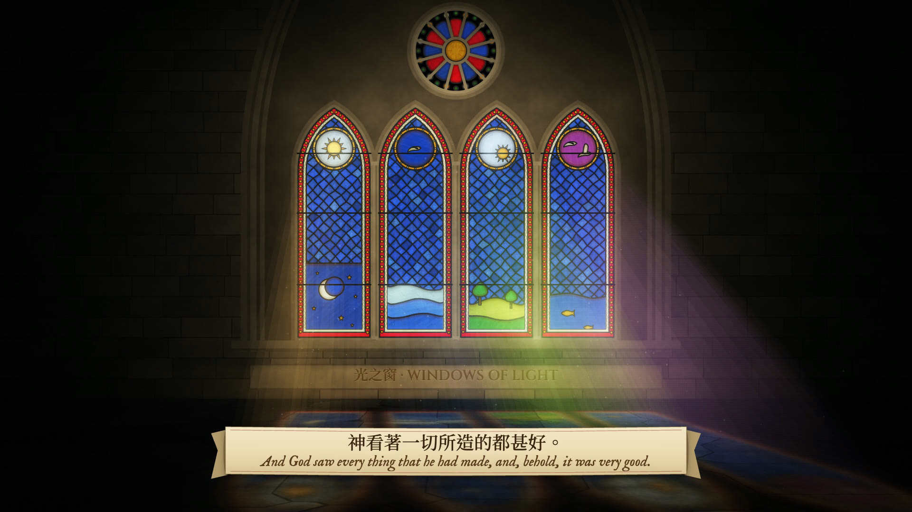
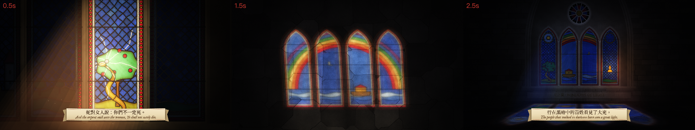
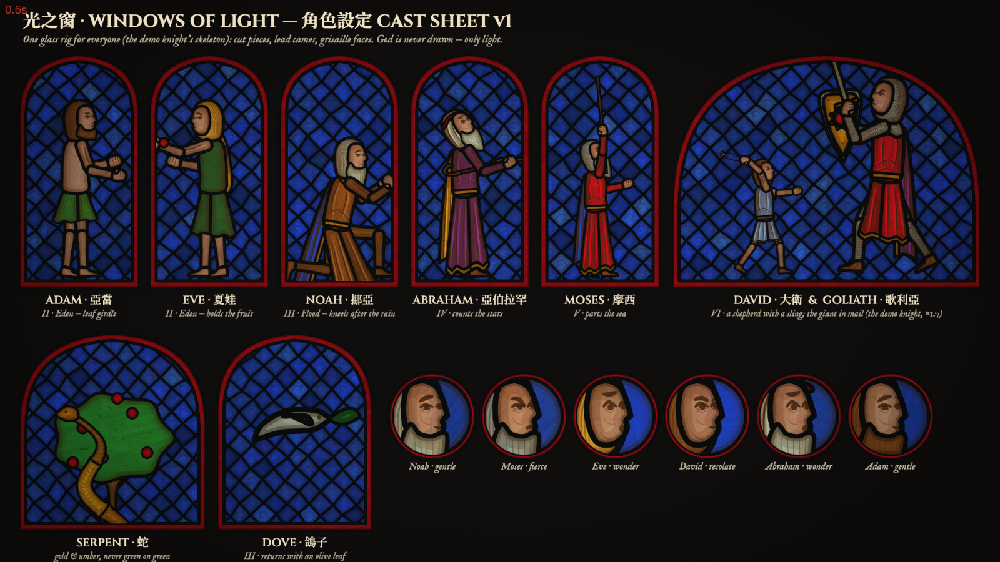

# 光之窗 · Windows of Light

The Old Testament told by light moving across one cathedral window: seven chapters, about 2 minutes, drawn
entirely in code (canvas + WebGL2 in headless Chrome, ffmpeg). No image or video models. God is never drawn;
God is the light.



| | |
|---|---|
| Style frames (Eden crack · Flood rainbow on the floor · Promise at night) |  |
| Cast sheet v1 |  |

## Chapters
01 起初 Genesis (done, sample) · 02 伊甸 Eden · 03 洪水 Flood · 04 亞伯拉罕 Abraham · 05 出埃及 Exodus ·
06 大衛 David & Goliath · 07 應許 Promise. Story, shot list and beat sheets: [TREATMENT.md](TREATMENT.md);
state and decisions: [PROGRESS.md](PROGRESS.md); music brief for Suno: [SUNO.md](SUNO.md).

## How it's built
- **Renderer:** the stained-glass style of [lemo-opuscar](https://github.com/lemomo-ai/lemo-opuscar/tree/main/styles/stained-glass)
  by LemoLab (code MIT, guide CC BY 4.0), vendored in [`sg/`](sg/README.md) with small hooks, plus `sg/figure.js`
  (robed figures on the demo knight's skeleton).
- **Clips:** `clips/NN-*.js`, each `state(t)` → one scene state (camera, sun band, pane contents, captions).
  `clips/_glass.js` = shared pane painters; `clips/sf.js`, `clips/cast.js` = style frames and cast sheet.
- **Sound:** `audio/music.mjs` — the Suno track (`audio/suno/film.wav`) plus code-built glass foley.
- **Tools:** this folder runs on a private video kit expected at `../_kit` (render / preview / compile / mix / QC).

```bash
node preview.mjs 01-genesis --every 1 --w 480   # frame grid
node render.mjs 01-genesis                      # clip → out/01-genesis.mp4
node compile.mjs                                # all clips → out/bible-story.mp4
```

### Rendering in the cloud (GitHub Actions)
**Actions → Render → Run workflow**: `target` = a clip id or `film`, `mode` = `render` / `preview` / `check`.
The result (mp4, srt, QC report or frame grids) is attached to the run as an artifact, kept 14 days:
`gh run download --repo dizhangai-star/bible-story` or the run page's *Artifacts* box.
One-time setup: push the kit to a private repo (default `dizhangai-star/video-kit`, or set the repo variable
`KIT_REPO`), and add a secret `KIT_TOKEN` = fine-grained PAT with *Contents: read* on that repo.

Captions: 和合本 (繁體) and KJV, both public domain. Fonts: Cinzel, IM Fell English, Noto Serif TC (OFL).
