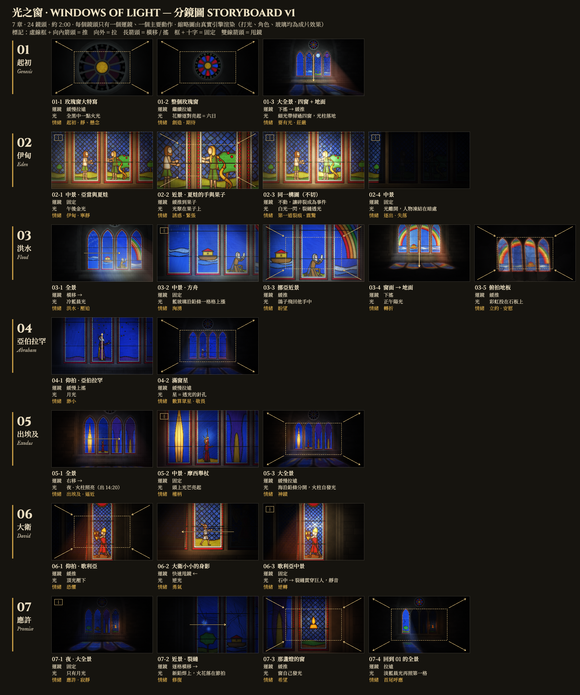

# 光之窗 · Windows of Light: Treatment

## 1. Brief
- Old Testament in one cathedral window, inspired by the light of the Sagrada Família glass. Look reused from
  lemo-opuscar `styles/stained-glass` (vendored in `sg/`). Shot language from cinematic-video-prompt-skill:
  each shot = shot size + angle + **one** camera move + **one** action + light + mood.
- ≈ 2:00 proposed (7 windows + prologue); **only the sample (01-genesis, 15 s) is approved to build now.**
- No narration. Captions: 繁體中文 (和合本) above, English (KJV) below, on the parchment banderole.
- Music: Suno (see `SUNO.md`); glass foley in code. Cast sheet before any chapter with people.

## 2. Logline and arc
A dark stone hall; light itself tells the Old Testament across one window, dawn to night.
**God is never drawn — God is the light.** Setup: light creates (the rose lights day by day). Turn: the glass
cracks (Eden) and the cracks multiply (Flood, Goliath). Ending: at night every crack is mended with lead — scars
stay — and one pane keeps its own light (Isa 9:2), echoing the opening spark; a thin dawn ray returns.
Hook (0.8 s): one spark in the black rose. Native move at the peak: crack → re-leading.

## 3. Benchmark
- **Sagrada Família** nave glass: cool blues/greens on the east (morning), warm reds/ambers on the west (evening);
  colour flooding the stone. *Learn:* colour-temperature arc across the film. *Don't take:* its designs.
- **Chartres** 12–13th c. windows (via the style guide): cobalt + ruby, grisaille, lead logic.
- **Beauty and the Beast (1991) prologue**: telling a back-story window by window. *Learn:* camera moving between
  panes, patient holds. *Don't take:* compositions, characters, music.

## 4. Storyboard (approved 2026-09-29) — 7 chapters · 24 shots · ≈ 2:00

Rendered with the real engine by `clips/board.js` + `node tools/storyboard.mjs` → `docs/storyboard.png`
(`board.js` also holds each shot's key-frame state: camera, light, panes; start each chapter clip from it).
Camera = a 2D view of the window wall (`cam [x, y, zoom]`) + perspective floor + a top-down floor cut; the sun band
is the second camera (only the lit pane is alive). Rule: **one camera move + one action per shot**.
One window per chapter; chapters cut through the unlit window (black), so clips fade in/out.

| shot | size / angle | camera | light | beat / mood |
|---|---|---|---|---|
| **01 起初 Genesis** | | | | |
| 01-1 | rose, ECU | slow pull back | a spark in total dark | "In the beginning" · still, suspense |
| 01-2 | whole rose | keep pulling | petals light in pairs = six days | creation · anticipation |
| 01-3 | wide, 4 lancets + floor | tilt down → slow push | thin sun band sweeps the lancets, shafts to the floor | "Let there be light" · awe |
| **02 伊甸 Eden** | | | | |
| 02-1 | MS, Adam & Eve (lancets II–III) | static | afternoon gold | the garden · calm |
| 02-2 | CU, Eve's hand and the fruit | slow push to the fruit | light gathers on the fruit | temptation · tension |
| 02-3 | same framing, no cut | none — the crack is the event | white flash, light pours through the crack | the first crack · shock (near-silence before, hard stop) |
| 02-4 | MS | static | the light leaves; the figures freeze in the dark | expulsion · loss |
| **03 洪水 Flood** | | | | |
| 03-1 | wide | truck right → | cold blue dawn | the flood · oppression |
| 03-2 | MS, the ark | static | blue pieces rise lead by lead | surging water |
| 03-3 | Noah, MCU | slow push | the dove returns to his hands | hope |
| 03-4 | window → floor | tilt down | noon sun | the turn |
| 03-5 | **top-down on the floor** | slow push | the rainbow thrown on the flagstones | the covenant · comfort |
| **04 亞伯拉罕 Abraham** | | | | |
| 04-1 | low angle, Abraham | slow tilt up | moonlight | smallness |
| 04-2 | the window full of stars | slow pull back | stars = pinholes of light | "count the stars" · reverence |
| **05 出埃及 Exodus** — at night, lit by the pillar of fire (Ex 14:20–27) | | | | |
| 05-1 | wide | truck right → | night; the pillar of fire is the light inside the glass | exodus · pursuit |
| 05-2 | MS, Moses raising the rod | static | the rays on his head light up | authority |
| 05-3 | extreme wide | slow pull back | the sea's pieces slide apart along the leads | the miracle |
| **06 大衛 David** | | | | |
| 06-1 | low angle, Goliath | slow push | top light pressing down | fear |
| 06-2 | David, small | whip pan ← | backlight | courage |
| 06-3 | Goliath, MS | static | the stone hits → a crack runs through the giant; silence | reversal |
| **07 應許 Promise** | | | | |
| 07-1 | night, extreme wide | static | moonlight only | promise · stillness |
| 07-2 | CU, the cracks | truck pane to pane → | new lead welds on, sparks on the beat | mending |
| 07-3 | the lamp's pane | slow push | the pane shines by its own light | hope |
| 07-4 | back to 01's wide, same framing | pull back | a pale dawn ray touches the first pane again | echo of the opening |

Rhythm: slow (01, 04) · building (03, 05) · fastest (06, one whip pan). Near-silences: before 02-3 and before the
last bell in 07. 07-4 repeats 01-3's framing: light from outside becomes light from within.

## 5. Beat sheet — 01-genesis (80 BPM, 0.75 s/beat)
| t | picture | caption | sound |
|---|---|---|---|
| 0–0.8 | black, rose barely visible | | room tone |
| 0.8 | spark: the rose's gold centre | | high glass note |
| 1.2–4.9 | ECU rose, drifting back | 起初，神創造天地。 | organ drone enters |
| 2.4 / 3.15 / 3.9 / 4.65 / 5.4 / 6.15 | petal pair lights clockwise from the top (stepped, 12 fps) | | glass D5 E5 F5 G5 A5 B5 |
| 5.5–9.1 | whole rose, pull back | 神說：「要有光」，就有了光。 | |
| 7.0 | knife-thin sun band enters lancet I, opens over all four; flash in the rose | | bell + air + open-fifth swell |
| 7.1–10 | pull back + tilt down to the wide; shafts, floor patch | | |
| 9.4–11.4 | light sweeps the carved 光之窗 · WINDOWS OF LIGHT | | air |
| 10.8–14.0 | slow push on the wide | 神看著一切所造的都甚好。 | |
| 14.3–15 | fade to black | | resolve |

## 6. Sound design
| section | ambience | foley | music | silence |
|---|---|---|---|---|
| all | stone hall room tone, long reverb (room .93) | struck glass (1:2.32:4.25:6.63:9.38), crack, lead creak, air | Suno track (SUNO.md) | before Eden crack; before the final bell |
